# ForgeNote

ForgeNote 是面向独立创作者的内容操作系统，用账号上下文把灵感推进为可编辑结构、主内容及跨语言、跨平台版本，并沉淀可复用工作流。

## 开发

```bash
npm install
npm run dev
```

本地访问 [http://localhost:3000](http://localhost:3000)。部署与环境配置见 [`docs/DEPLOYMENT.md`](docs/DEPLOYMENT.md)，运行维护见 [`docs/RUNBOOK.md`](docs/RUNBOOK.md)。

## 文档入口

- **当前产品需求事实源**：[`docs/PRD-CCOS.md`](docs/PRD-CCOS.md)
- **冻结的 M2 实现基线**：[`docs/PRD-M2.md`](docs/PRD-M2.md)
- **文档索引与 Agent 阅读顺序**：[`docs/README.md`](docs/README.md)
- **已拍板决策**：[`docs/DECISIONS.md`](docs/DECISIONS.md)

> 阅读原则：新产品需求、范围与优先级以 `PRD-CCOS.md` 为准；`PRD-M2.md` 只用于解释现有 M2 代码、Ticket 和验收，不再接收新需求，也暂不归档。

## Docs 信息架构

```mermaid
flowchart TD
  ROOT[README.md<br/>仓库入口] --> INDEX[docs/README.md<br/>文档索引与阅读规则]
  INDEX --> GOV[治理与事实源]
  INDEX --> PRODUCT[产品定义]
  INDEX --> UX[UX 规格]
  INDEX --> ENG[工程契约]
  INDEX --> DELIVERY[交付与验证]
  INDEX --> HISTORY[历史与过程材料]

  GOV --> DEC[DECISIONS.md]
  GOV --> ROADMAP[roadmap/roadmap.json]
  GOV --> OPS[OPERATING-MODEL.md]

  PRODUCT --> CCOS[PRD-CCOS.md<br/>下一版产品方向]
  PRODUCT --> M2[PRD-M2.md<br/>当前实现基线]
  PRODUCT --> MVP[MVP-FEATURE-LIST.md]

  UX --> JOURNEY[USER-JOURNEY.md]
  UX --> IA[INFORMATION-ARCHITECTURE.md]
  UX --> FLOW[UX-FLOW.md]
  UX --> DESIGN[DESIGN.md / UIUX-M2.md]
  UX --> PROTO[低保真原型包]

  ENG --> DATA[DATA-SCHEMA-M2.md]
  ENG --> API[API-CONTRACT-M2.md]
  ENG --> MODEL[MODEL-INTEGRATION.md]
  ENG --> DEPLOY[DEPLOYMENT.md / RUNBOOK.md]

  DELIVERY --> ACCEPT[acceptance/]
  DELIVERY --> GATE[gate0/]
  DELIVERY --> RESEARCH[research/]

  HISTORY --> ARCHIVE[archive/]
  HISTORY --> DESIGNRUNS[design/]
  HISTORY --> AGENTRUNS[agent-runs/]
  HISTORY --> PROMPTS[prompts/]
```



## 重复文档治理建议

以下分类基于文档职责、版本状态和内容重叠度；这是治理建议，不代表本次已移动或删除文件。

### 建议保留

| 文档 | 保留理由 |
|---|---|
| `docs/README.md` | `docs/` 唯一索引，继续作为详细阅读规则入口 |
| `docs/DECISIONS.md`、`docs/roadmap/roadmap.json` | 分别作为决策事实源与进度事实源，职责不可合并 |
| `docs/PRD-CCOS.md` | 下一版产品定义总纲，覆盖目标用户、边界与长期产品模型 |
| `docs/PRD-M2.md` | 当前代码和验收对应的里程碑基线，不应用未来 PRD 覆盖 |
| `docs/INFORMATION-ARCHITECTURE.md` | 专门定义对象、导航、页面与内容层级 |
| `docs/UX-FLOW.md` | 专门定义任务流、决策、反馈与异常恢复 |
| `docs/USER-JOURNEY.md` | 保留用户场景与需求依据，避免 IA/Flow 变成无依据规范 |
| `docs/DATA-SCHEMA-M2.md`、`docs/API-CONTRACT-M2.md` | 当前工程契约，分别约束数据和接口 |
| `docs/DEPLOYMENT.md`、`docs/RUNBOOK.md` | 前者负责部署配置，后者负责日常运维与故障处理 |
| `docs/acceptance/`、`docs/gate0/` | 分别保存逐项验收证据和阶段性 Gate 证据 |

### 建议合并

| 文档组 | 建议目标 | 原因 |
|---|---|---|
| `MVP-FEATURE-LIST.md` + `PRD-CCOS.md` 的 MVP/优先级章节 | 合并回 `PRD-CCOS.md`，或让清单仅保留可追踪 ID 并引用 PRD | 产品范围、优先级和验收口径容易双写漂移 |
| `LOW-FIDELITY-PROTOTYPE-PLAN.md` + `LOW-FIDELITY-WIREFRAMES.md` | 合为一份“低保真原型规格”，计划作为前章、线框作为主体 | 同属一轮原型交付，拆分增加跳转但没有独立事实源价值 |
| `UX-STRUCTURE-VALIDATION.md` + 原型计划中的测试计划 | 验证方案只保留在 `UX-STRUCTURE-VALIDATION.md`，其他文档引用 | 研究问题、任务脚本、通过标准不应重复维护 |
| `UI-DESIGN-SYSTEM-REFACTOR.md` + `design/redefine-2026-07/design-tokens.md` | 形成一个当前设计系统基线；迁移说明单独归档 | Token 和重构目标属于同一规范层，当前/过程信息需分离 |
| `DESIGN.md` + `UIUX-M2.md` 中仍有效的视觉规范 | 选定一个当前 UI 总规范，另一个只保留版本差异链接 | 两份总设计说明最容易产生组件、布局和视觉方向冲突 |
| `G0-LEAN-KIT.md` + `gate0/week-template.md` 中重复模板 | Lean Kit 保留方法，周记模板只保留可填写字段 | 避免指标说明、访谈问题和周记字段多处复制 |

### 建议归档

| 文档或目录 | 建议位置 / 原因 |
|---|---|
| `docs/ForgeNote_重定义方向_v3.md` | 若关键结论已进入 `PRD-CCOS.md`，移至 `archive/product-direction/`，避免成为第三份 PRD |
| `docs/UIUX-M2.md` | 当有效内容合并进当前设计规范后移至 `archive/m2/`；当前阶段可暂留作代码基线 |
| `docs/design/redefine-2026-07/*REVIEW*`、`*HANDOFF*`、`CODEX-CODE-REVIEW-M2.md` | 属于阶段性交接/审查记录，完成后移至 `archive/design-runs/2026-07/` |
| `docs/design/dsn-01-open-design/`、`docs/design/dsn-02-login-auth/` | 已结束的设计运行材料按 DSN 整体归档，当前规范只链接最终产物 |
| `docs/agent-runs/`、`docs/prompts/` | 作为执行证据归档，不应出现在日常产品文档阅读路径中 |
| 已完成且不再作为回归入口的 `docs/acceptance/I-*.md` | 按里程碑打包到 `archive/acceptance/`；仍用于回归的条目继续保留 |
| `docs/archive/PROJECT-STATUS.md`、`PROJECT-GANTT.md`、`TICKETS.md` | 已正确归档；确保任何当前文档不再把它们当进度事实源 |

## 文档维护规则

1. 每类事实只指定一个主文档；其他文档使用链接，不复制整段定义。
2. 文件头必须写明 `状态`、`版本/日期`、`事实源或替代关系`。
3. 产品方向变化先更新 `PRD-CCOS.md` 和 `DECISIONS.md`；当前实现变化同步 `PRD-M2.md` 与工程契约。
4. 设计评审、Agent run、prompt、handoff 是过程证据，任务结束后归档，不进入默认阅读链路。
5. 归档前确认仍有效内容已合入主文档；归档文件保持只读，并在文件头标注替代文档。
