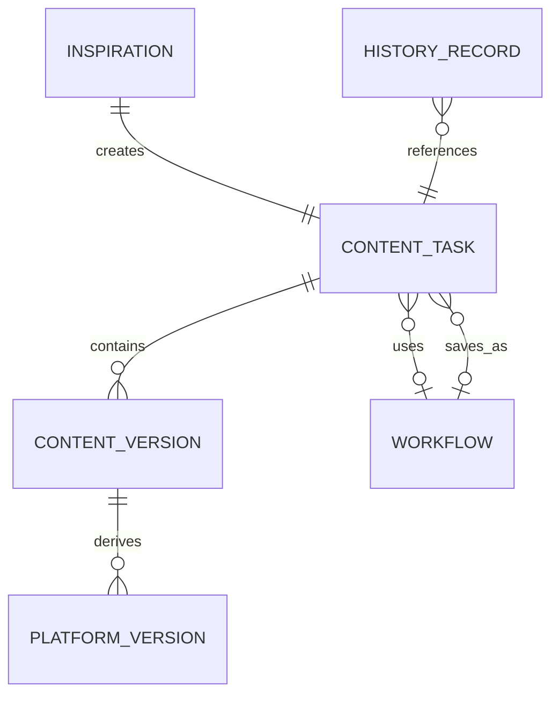
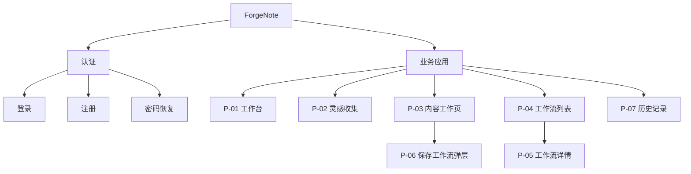
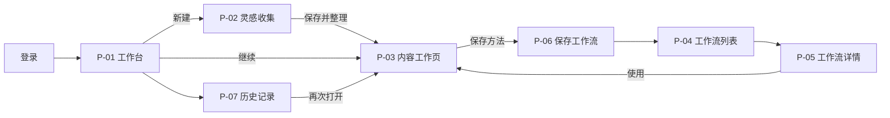

# ForgeNote · 信息架构与导航结构

> 文档版本：v1.1  
> 状态：❄️ 已冻结（2026-07-12，D-13/D-14）——北极星愿景的 UX 基线，非开发依据；当前执行见 `docs/GATE0-SLICE-PLAN.md`  
> 日期：2026-07-11

## 1. 文档目的

本文档定义 ForgeNote MVP 的核心对象、对象关系、信息组织、导航结构、页面清单与页面内容层级。

它回答：

- 用户在产品中管理什么
- 内容如何分类和关联
- 用户如何找到主要功能
- MVP 包含哪些页面
- 每个页面优先展示什么

本文档不定义视觉样式、组件细节、API 或完整技术状态矩阵。任务路径和异常恢复见 `UX-FLOW.md`，用户依据见 `USER-JOURNEY.md`。

---

## 2. IA 设计原则

1. **围绕用户对象，而非 AI 能力组织导航**：用户找的是内容、工作流和历史，而不是“改写”“翻译”等工具。
2. **连续创作不拆页**：整理、结构、草稿、本地化和平台适配在同一内容任务上下文中完成。
3. **原始内容与派生版本关系清晰**：通用稿、语言版本和平台版本不能成为无关联副本。
4. **历史与工作流分工明确**：历史用于找回做过的内容；工作流用于复用做内容的方法。
5. **渐进呈现复杂度**：先完成当前任务，再暴露语言、平台和复用能力。
6. **全局主操作稳定**：用户在主要页面都能快速新建灵感。

---

## 3. 核心对象

### 3.1 对象定义

| 对象 | 定义 | 用户心智 | MVP 核心属性 |
|---|---|---|---|
| 账号大脑 | 为当前账号持续提供生成依据的长期上下文 | “这个账号是谁、适合怎么表达” | 受众、定位、主题边界、语气、有效模式、避免事项、平台偏好 |
| 灵感 | 尚未完整处理的原始输入 | “我记下来的东西” | 原始文本、链接/引用、来源、创建时间 |
| 内容任务 | 将一条灵感推进为可用内容的工作上下文 | “我正在做的这条内容” | 当前阶段、主题、方向、结构、草稿、更新时间 |
| 内容版本 | 同一内容任务中的通用稿或语言版本 | “这条内容的不同表达” | 语言、来源版本、编辑状态、正文 |
| 平台版本 | 基于内容版本派生的目标平台输出 | “准备发到某个平台的版本” | 目标平台、来源版本、格式、正文 |
| 工作流 | 可复用的结构和处理方式 | “下次可以沿用的方法” | 名称、适用场景、结构模式、语气、语言与平台配置 |
| 历史记录 | 已保存内容任务和版本的可检索视图 | “以前做过什么” | 内容任务引用、阶段、更新时间、输出摘要 |

### 3.2 对象关系



### 3.3 关键边界

- 账号大脑是长期账号上下文，不是每次创作必须重复完成的流程步骤；首次可以跳过并在之后补充。
- 灵感是原始输入，内容任务是处理上下文；推荐选题、历史和工作流也可创建内容任务。
- 内容版本属于某个任务；中文、英文和平台版本不是独立内容任务。
- 目标语言与目标平台在用户界面中组合为“派生版本”，避免强制先翻译再适配。
- 工作流不保存某篇文章本身，而保存可复用的方法和配置。
- 历史记录不是独立创作对象，只是内容任务的找回入口。

三类长期信息的心智边界：账号大脑回答“我是谁”，工作流回答“我怎么做”，历史回答“我做过什么”。

---

## 4. 内容组织模型

### 4.1 内容任务内部层级

```text
内容任务
├── 原始灵感
├── 整理结果
│   ├── 主题
│   ├── 关键词
│   └── 内容方向
├── 内容结构
├── 通用草稿
├── 语言版本
│   ├── 中文版本
│   └── 英文版本
├── 平台版本
│   ├── 国内平台版本
│   └── 海外平台版本
└── 关联信息
    ├── 使用的工作流
    ├── 保存出的工作流
    └── 历史版本
```

### 4.2 分类原则

- 标签和分类属于辅助元信息，不作为 MVP 一级导航。
- 内容主要通过“进行中 / 已归档”和当前阶段区分。
- 工作流按适用场景、最近使用和名称组织；MVP 不引入模板市场。
- 历史记录按最近更新时间为默认顺序，基础搜索和筛选为 P1。

---

## 5. Sitemap



认证属于基础设施，不计入本轮核心业务页面数量；其详细 IA 待认证方案确认。

---

## 6. 导航结构

### 6.1 全局导航

| 导航项 | 目的 | 出现范围 | 优先级 |
|---|---|---|---|
| 工作台 | 查看当前任务并决定下一步 | 所有业务一级页面 | P0 |
| 工作流 | 查找和复用已保存方法 | 所有业务一级页面 | P0 |
| 历史记录 | 找回过去的内容任务 | 所有业务一级页面 | P1 |
| 新建灵感 | 随时创建新的原始输入 | 主要业务页面固定可见 | P0 主操作 |
| 账户菜单 | 账户与退出 | 全局 | 基础设施 |

### 6.2 四区工作台与上下文导航

内容工作页采用“左 / 中 / 右 / 下”四区：

- **左区**：账号与任务上下文，包括当前账号、账号大脑状态、当前任务、任务来源、推荐选题和最近内容。
- **中区**：创作主工作区，顶部切换 `想法与方向 / 内容结构 / 主内容 / 目标版本`。
- **右区**：随中区阶段变化的依据与设置，回答“当前结果基于什么、可以调整什么”。
- **下区**：随阶段变化的唯一主操作与目标输出选择。

规则：

- 阶段切换表示同一内容任务内的进度，不加入全局导航。
- 已完成阶段可返回修改。
- 派生版本按需创建，不阻塞主内容完成。
- 修改上游结果时，明确提示哪些下游版本可能需要更新。
- 灵感、选题雷达、历史和工作流是任务来源，进入后汇聚到同一中区流程。

### 6.3 导航优先级

1. 当前内容任务和下一步
2. 新建灵感
3. 复用工作流
4. 找回历史内容
5. 账户与辅助设置

---

## 7. 页面清单

| ID | 页面 | 建议路由 | 层级 | 优先级 | 用户目标 | 核心职责 |
|---|---|---|---|---|---|---|
| P-01 | 工作台 | `/` | 一级 | P0 | 快速决定下一步做什么 | 汇总进行中任务、最近内容和主要入口 |
| P-02 | 灵感收集 | `/inspirations/new` | 任务入口 | P0 | 无负担保存粗糙想法 | 保存原始输入并创建内容任务 |
| P-03 | 内容工作页 | `/contents/:contentId` | 一级核心页 | P0 | 将灵感推进为可用内容 | 承载连续创作阶段和派生版本 |
| P-04 | 工作流列表 | `/workflows` | 一级 | P0 | 找到可复用的方法 | 浏览、选择和复用工作流 |
| P-05 | 工作流详情 | `/workflows/:workflowId` | 二级 | P0 | 判断工作流是否适用 | 展示保存内容、场景和使用入口 |
| P-06 | 保存工作流 | 内容工作页内弹层 | 局部流程 | P0 | 沉淀本次有效方法 | 解释、命名并保存复用配置 |
| P-07 | 历史记录 | `/history` | 一级 | P1 | 找回过去做过的内容 | 查找并恢复内容任务 |

### 7.1 不单独建页的能力

| 能力 | 承载位置 | 原因 |
|---|---|---|
| 内容整理 | P-03 整理阶段 | 与原始输入和结构连续关联 |
| 内容结构化 | P-03 结构阶段 | 需要局部编辑和回退 |
| AI 改写 / 扩写 | P-03 草稿阶段或选区操作 | 是编辑动作而非独立对象 |
| 中英本地化 | P-03 语言版本区 | 与来源内容保持派生关系 |
| 平台适配 | P-03 平台版本区 | 各平台输出共享同一任务上下文 |
| 版本记录 | P-03 历史抽屉或侧栏 | MVP 不做独立版本树 |
| 标签 / 分类 | 灵感和内容元信息区 | P1 辅助能力，不形成管理页 |

---

## 8. 页面内容层级

### 8.1 P-01 工作台

**用户问题：** 我现在应该继续哪一条，还是开始新的内容？

| 层级 | 内容 | 目的 |
|---|---|---|
| L1 | 继续上次内容 / 新建灵感 | 让用户立即行动 |
| L2 | 进行中任务及当前阶段 | 降低恢复上下文成本 |
| L3 | 推荐复用的工作流 | 支持从已有方法开始 |
| L4 | 最近完成内容 | 提供找回与复用入口 |

主操作：继续创作；无进行中任务时为新建灵感。  
次操作：使用工作流、查看历史。

### 8.2 P-02 灵感收集

**用户问题：** 如何快速保存这个尚未成形的想法？

| 层级 | 内容 | 目的 |
|---|---|---|
| L1 | 原始内容输入 | 完成最小收集任务 |
| L2 | 链接、引用或来源 | 保留上下文 |
| L3 | 可选标签与补充说明 | 帮助后续找回，不阻塞保存 |
| L4 | 输入示例和支持说明 | 降低首次使用门槛 |

主操作：保存并整理。  
次操作：仅暂存。

### 8.3 P-03 内容工作页

**用户问题：** 如何把当前想法推进到可发布状态，同时保留控制？

| 层级 | 内容 | 目的 |
|---|---|---|
| L1 | 当前阶段、核心结果与下一步操作 | 聚焦当前任务 |
| L2 | 原始灵感和上游依据 | 保持结果可追溯 |
| L3 | 阶段导航 | 支持理解进度与返回修改 |
| L4 | 语言和平台派生版本 | 在需要时展开复杂度 |
| L5 | 自动保存、版本和关联工作流 | 建立内容安全感 |

主操作随阶段变化：整理、生成结构、生成草稿、生成版本或导出。  
次操作：返回修改、重生成、保存为工作流、归档。

### 8.4 P-04 工作流列表

**用户问题：** 我以前保存的哪种方法适合这次内容？

| 层级 | 内容 | 目的 |
|---|---|---|
| L1 | 工作流名称、适用场景与“使用”操作 | 快速判断并复用 |
| L2 | 结构、语气、语言和平台摘要 | 解释将复用什么 |
| L3 | 最近使用和复用次数 | 提供熟悉度线索 |
| L4 | 基础搜索或筛选 | 工作流增多后帮助查找 |

主操作：使用工作流。  
次操作：查看详情。

### 8.5 P-05 工作流详情

**用户问题：** 这个工作流会带入什么，是否适合当前任务？

| 层级 | 内容 | 目的 |
|---|---|---|
| L1 | 名称、适用场景和使用入口 | 支持复用决策 |
| L2 | 结构模式和处理步骤 | 解释核心方法 |
| L3 | 语气、语言和平台配置 | 解释自动带入项 |
| L4 | 最近使用记录 | 展示实际用途 |

主操作：用此工作流创作。  
次操作：返回列表。

### 8.6 P-06 保存工作流弹层

**用户问题：** 保存后下次能复用什么？

| 层级 | 内容 | 目的 |
|---|---|---|
| L1 | 将保存内容的明确摘要 | 建立正确预期 |
| L2 | 工作流名称 | 支持以后识别 |
| L3 | 适用场景说明 | 支持以后判断是否复用 |
| L4 | 可选配置确认 | 防止保存无关内容 |

主操作：保存工作流。  
次操作：取消并继续编辑。

### 8.7 P-07 历史记录

**用户问题：** 我以前做过的那条内容在哪里？

| 层级 | 内容 | 目的 |
|---|---|---|
| L1 | 标题、来源、当前阶段和更新时间 | 快速识别内容 |
| L2 | 已有语言与平台输出摘要 | 判断完成程度 |
| L3 | 搜索和基础筛选 | 支持记录增多后的找回 |
| L4 | 关联工作流 | 解释内容来源与复用途径 |

主操作：再次打开。  
次操作：基于此内容复用。

---

## 9. 页面入口与流向



关键规则：

- 保存灵感后直接进入内容任务，不要求返回列表。
- 从工作流创建的是新内容任务，不修改原工作流。
- 从历史“再次打开”恢复原任务；“基于此内容复用”创建新任务。
- 导出是内容工作页内动作，不新增发布页面；MVP 不支持自动发布。

---

## 10. 关键 UX 状态

本阶段只记录会改变任务路径或信息结构的状态；详细组件与技术状态留待交互规格阶段。

| 状态 | IA / 导航影响 |
|---|---|
| 首次使用、无内容 | 工作台以新建灵感为唯一主操作 |
| 有进行中任务 | 工作台优先展示继续创作 |
| 输入不足 | 灵感可暂存，不强制进入整理 |
| 生成失败 | 用户留在当前阶段，可编辑或重试 |
| 上游内容修改 | 下游版本保留但标记需更新 |
| 未保存离开 | 保留当前上下文并确认离开 |
| 历史恢复失败 | 留在历史上下文并提供可用版本 |
| 工作流复用失败 | 留在工作流上下文，不创建空任务 |

---

## 11. 功能与页面映射

| MVP 功能 | 承载页面 |
|---|---|
| F-01 灵感收集 | P-01、P-02 |
| F-02 内容整理 | P-03 |
| F-03 内容结构化 | P-03 |
| F-04 AI 改写 / 扩写 | P-03 |
| F-05 中英双语本地化 | P-03 |
| F-06 平台适配 | P-03 |
| F-07 工作流保存 | P-03、P-06、P-04、P-05 |
| F-08 内容历史记录 | P-01、P-07、P-03 |

---

## 12. 待验证的 IA 问题

- “灵感”是否需要独立列表，还是历史记录足以承载找回？
- “工作流”是否符合用户语言，是否应显示为“创作方法”或“模板”？
- 用户更容易按内容阶段、时间还是平台查找历史？
- 内容工作页的阶段导航是否被理解为可返回编辑，而非强制步骤？
- 用户如何理解中文、英文、通用稿和平台版本之间的关系？
- 历史“继续原任务”和“创建副本复用”是否需要更明确区分？

---

## 13. 下一阶段验证

- 结构研究问题、访谈提纲与测试任务见 `UX-STRUCTURE-VALIDATION.md`。
- 页面低保真布局与关键状态见 `LOW-FIDELITY-WIREFRAMES.md`。
- 可点击原型画面、跳转和测试轮次见 `LOW-FIDELITY-PROTOTYPE-PLAN.md`。
- 未通过结构验证 Gate 前，不将本 IA 视为最终实现规格。

---

## 14. 版本记录

- v1.0：从页面规格重构为 UX 阶段的信息架构文档，补充核心对象、对象关系、Sitemap、导航、页面内容层级和待验证问题。
- v1.1：补充 UX 结构验证、低保真线框和可点击原型的阶段衔接。
