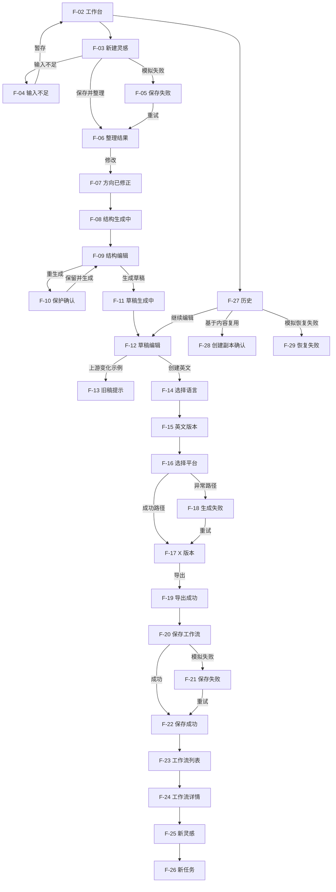

# ForgeNote · 低保真可点击原型计划

> 状态：❄️ **已冻结（2026-07-12，G0S-12 阶段 0）——随 CCOS 冻结；可复用骨架将折入 PHASE-2**  
> 文档版本：v1.0  
> 日期：2026-07-11

## 1. 目的

本计划定义 ForgeNote MVP 低保真可点击原型的范围、画面编号、跳转关系、测试数据、异常分支和验收 Gate。

原型用于验证结构和流程，不用于展示最终视觉，也不应被直接视为开发规格。

### 1.1 浏览器原型入口

原型已直接实现于项目中，无需 Figma：

- 路由：`/ux-prototype`
- 实现：`src/app/ux-prototype/page.tsx`
- 样式：`src/app/ux-prototype/prototype.module.css`
- 启动：运行 `npm run dev` 后在浏览器打开 `http://localhost:3000/ux-prototype`

页面顶部“低保真测试模式”提供主持人异常控制，可独立模拟灵感保存失败、平台生成失败、工作流保存失败和历史恢复失败。该路由使用固定数据，不连接真实 AI、数据库或认证。

---

## 2. 原型范围

### 2.1 必须支持的任务

- T-01 暂存一条不完整灵感
- T-02 修正整理方向并生成结构
- T-03 修改结构、生成和优化草稿
- T-04 创建英文目标平台版本
- T-05 从平台生成失败中恢复
- T-06 保存工作流并创建新任务
- T-07 恢复历史内容并区分复用
- T-08 识别无权限 / 受限状态

任务脚本和测试指标以 `UX-STRUCTURE-VALIDATION.md` 为准。

### 2.2 不纳入本轮

- 登录、注册与密码找回细节
- 视觉设计系统
- 真实 AI 请求和流式生成
- 真实链接解析
- 完整搜索和筛选
- 自动发布
- 团队、权限、计费和设置
- 移动端完整原型

### 2.3 无权限状态覆盖原则

本轮不实现完整权限系统，但原型与文档必须覆盖用户会实际遇到的“受限”状态，并用产品语言表达，而不是用技术错误码表达。

优先覆盖以下场景：

- 未登录访问工作台：引导到登录页
- 未完善账号大脑：允许继续创作，但提示结果使用通用默认值
- 未选定目标平台：不能生成目标版本，只能保存主内容
- 未拥有足够输入：允许暂存，不阻断离开
- 访问历史失败：保留当前位置，提供上一可用内容
- 访问工作流失败：保留内容任务，不创建空任务

以上状态均应表现为“可恢复的产品状态”，不是“系统报错”。

### 2.4 需单独展示的受限提示

- 左下角个人信息点击后，如果账号大脑未建立，先显示“可选完善账号大脑”而不是禁止进入。
- 工作台中区在缺少账号资料时，右区显示“当前结果使用通用默认值”。
- 目标版本阶段在没有目标平台时，底部主操作保持禁用并说明原因。
- 历史恢复失败时，保留当前内容任务并提供“打开上一可用内容”。

---

## 3. 原型保真度规则

- 使用灰阶和系统字体。
- 只使用矩形、文本、基础表单和简单图标占位。
- 不使用品牌插画、阴影、渐变和装饰动效。
- 文案应足够真实，可用于判断信息层级。
- AI 结果使用固定样例，保证参与者看到一致内容。
- 生成状态可用 1–2 秒模拟延迟后进入固定结果。
- 每个关键点击必须有可见反馈，不制作无意义死按钮。

---

## 4. 测试数据场景

### 4.1 示例用户

- 独立创作者
- 领域：AI 与个人效率
- 主要平台：小红书、X
- 默认语言：中文
- 已有两个历史任务和一个工作流

### 4.2 示例灵感

> 很多人以为 AI 写作的问题是提示词不够好，但真正的问题可能是没有先把观点和结构想清楚。想写一条关于“先搭结构，再让 AI 写”的内容，最好有一个我自己反复返工的例子。

### 4.3 故意错误的整理结果

系统初始将受众判断为“企业内容团队”。测试期望用户将其修正为“独立创作者”。

### 4.4 示例结构

1. Hook：AI 写作返工，不一定是提示词问题
2. 误区：直接要求 AI 生成完整文章
3. 经历：反复改提示词仍然不满意
4. 洞察：缺的是观点与结构控制
5. 方法：先确认方向，再搭结构，最后生成
6. CTA：分享自己的 AI 写作流程

### 4.5 示例输出

- 通用中文草稿
- 英文本地化版本
- X 平台版本
- 一个故意失败的平台生成状态
- 工作流名称建议：“观点先行的 AI 内容结构”

---

## 5. 画面清单

| Frame ID | 页面 / 状态 | 用途 | 来源线框 |
|---|---|---|---|
| F-01 | 工作台首次空状态 | T-01 起点变体 | P-01 空状态 |
| F-02 | 工作台有进行中任务 | T-02 / T-07 起点 | P-01 默认 |
| F-03 | 灵感收集默认 | 输入新灵感 | S-02A |
| F-04 | 灵感输入不足 | 暂存分支 | S-02B |
| F-05 | 灵感保存失败 | 错误恢复 | S-02D |
| F-06 | 整理阶段初始结果 | 修正错误方向 | S-03A |
| F-07 | 整理已修正 | 生成结构前确认 | S-03A |
| F-08 | 结构生成中 | 系统反馈 | S-03B |
| F-09 | 结构可编辑 | 修改结构 | S-03B |
| F-10 | 重生成保护确认 | 验证不覆盖 | 结构确认 |
| F-11 | 草稿生成中 | 系统反馈 | S-03C |
| F-12 | 草稿可编辑 | 局部精简 | S-03C |
| F-13 | 上游结构已更新 | 旧稿保护 | S-03D |
| F-14 | 创建语言版本 | 选择英文 | S-03E |
| F-15 | 英文本地化版本 | 编辑与选平台 | S-03E |
| F-16 | 选择目标平台 | 选择 X 和来源 | S-03F |
| F-17 | X 平台版本 | 预览与导出 | S-03F |
| F-18 | X 生成失败 | T-05 恢复 | 平台错误 |
| F-19 | 导出成功反馈 | 完成节点 | P-03 |
| F-20 | 保存工作流弹层 | 解释保存范围 | P-06 |
| F-21 | 工作流保存失败 | 保存恢复 | P-06 错误 |
| F-22 | 工作流保存成功 | 下一步入口 | P-03 |
| F-23 | 工作流列表 | 查找方法 | P-04 |
| F-24 | 工作流详情 | 判断和使用 | P-05 |
| F-25 | 使用工作流输入新灵感 | 创建新任务 | P-02 变体 |
| F-26 | 新任务已创建 | 验证原任务不变 | P-03 |
| F-27 | 历史记录 | T-07 找回 | P-07 |
| F-28 | 创建副本确认 | 区分继续和复用 | 确认模式 |
| F-29 | 历史恢复失败 | 异常恢复 | P-07 错误 |

---

## 6. 可用性测试后的修正清单

以下问题在本轮测试后优先检查并修正：

1. **无权限与受限状态是否被理解**
   - 未登录是否能被正确引导到登录页
   - 未完善账号大脑时，用户是否理解“可继续创作，但建议更准确”
   - 受限状态是否被误认为系统故障

2. **首页到工作台的路径是否足够直接**
   - 登录后是否能一眼看到中央创作入口
   - 左侧导航是否过重，是否干扰主入口
   - 个人设置是否过于显眼

3. **AI 胶囊是否足够轻量**
   - 是否被误认为主要操作
   - 是否遮挡内容编辑
   - 是否容易被忽略

4. **左区与底栏信息密度是否平衡**
   - 创作者信息是否放在左下角且不过度抢占空间
   - “保存想法 / 保存工作流 / 保存版本”是否出现在正确位置
   - 收起左区后，中心画布是否足够宽

5. **中区阶段切换是否清晰**
   - 用户是否明白“想法与方向 / 内容结构 / 主内容 / 目标版本”是同一任务的不同层
   - 当前阶段是否有明确主操作
   - 阶段切换后右区是否跟着变化

6. **保存与导出反馈是否可信**
   - 保存想法、保存工作流、保存版本是否有明确完成反馈
   - 导出或复制成功时是否能找到结果
   - 失败后是否保留用户当前内容

7. **历史与工作流的边界是否清楚**
   - 用户能否区分“继续原内容”“复用方法”“查看历史”
   - 工作流详情是否说明不会保存整篇正文

8. **术语是否需要进一步简化**
   - 账号大脑
   - 目标版本
   - 工作流
   - 结构稳定
   - 选题雷达

每一轮测试后，先把上述清单里的问题补到本文件，再回填 `UX-STRUCTURE-VALIDATION.md` 的问题严重度与结论。

---

## 6. 原型跳转图

---

## 7. 任务路径与原型起点

| 任务 | 起点 | 预期路径 | 关键判断 |
|---|---|---|---|
| T-01 | F-01 或 F-02 | F-03 → F-04 → F-02 | 是否理解可暂存 |
| T-02 | F-02 | F-06 → F-07 → F-08 → F-09 | 是否修正错误方向 |
| T-03 | F-09 | F-09 → F-11 → F-12 | 是否局部编辑并继续 |
| T-04 | F-12 | F-14 → F-15 → F-16 → F-17 | 是否理解语言与平台来源 |
| T-05 | F-16 | F-18 → F-17 | 是否原地恢复 |
| T-06 | F-19 | F-20 → F-22 → F-23 → F-24 → F-25 → F-26 | 是否理解保存和复用 |
| T-07 | F-02 | F-27 → F-12；F-27 → F-28 | 是否区分继续与副本 |

---

## 8. 交互规则

### 8.1 导航

- 全局导航在 P-01、P-04、P-07 保持稳定。
- P-02 与 P-03 提供明确返回路径。
- 返回不应跳到无法预测的位置。
- 阶段导航点击已完成步骤时恢复该阶段，不创建新任务。

### 8.2 生成

- 点击生成后先进入生成中画面，再自动前往固定结果。
- 生成失败只影响当前对象。
- 重试返回同一任务上下文。
- 原型中的取消可回到生成前画面。

### 8.3 编辑

- 关键输入需要呈现可编辑状态，即使不实现真实文本变化，也要提供已编辑后的下一画面。
- 用户修改过的内容在重生成确认中明确受保护。

### 8.4 保存与反馈

- 主操作点击后必须有保存中或成功反馈。
- 保存失败画面必须保留输入。
- 成功反馈说明对象保存位置和下一步。

### 8.5 复用

- 从工作流使用时创建新任务。
- 从历史继续时打开原任务。
- 从历史复用时经过创建副本确认。

---

## 9. 主持人控制点

为避免参与者偶然遇到所有异常，原型需提供主持人可触发入口或独立链接：

- 灵感保存失败
- 平台生成失败
- 工作流保存失败
- 历史恢复失败
- 上游结构更新导致草稿过期

每个异常场景应可独立重置，不要求从 F-01 重走完整流程。

---

## 10. 原型检查清单

### 10.1 完整性

- [ ] F-01 至 F-29 均已制作或有明确合并理由
- [ ] T-01 至 T-07 均有独立起点
- [ ] 主路径没有死链接
- [ ] 异常路径可恢复到主路径
- [ ] 所有返回操作目的地明确

### 10.2 内容一致性

- [ ] 页面名称和 ID 与 `INFORMATION-ARCHITECTURE.md` 一致
- [ ] 决策和异常与 `UX-FLOW.md` 一致
- [ ] 文案不承诺自动发布
- [ ] 工作流不表现为保存文章正文
- [ ] 历史继续与副本复用结果不同

### 10.3 可测试性

- [ ] 原型不使用颜色暗示正确答案
- [ ] 可点击区域不超出可见控件
- [ ] 参与者可以在没有主持人提示时完成任务
- [ ] 错误信息包含内容安全与恢复方式
- [ ] 每个任务完成节点可被明确记录

---

## 11. 测试轮次

### Round 0：内部认知走查

参与者：产品、UX、工程各至少 1 人。

目标：修复死路、术语不一致和明显流程缺口，不把内部意见当用户证据。

### Round 1：3 名目标用户

目标：发现结构性 S3/S2 问题。测试后必须迭代原型和三个 UX 基线文档。

### Round 2：3–5 名目标用户

目标：验证修订是否达到 Gate，观察是否出现新的高频问题。

必要时增加分群轮次，比较单平台用户与多平台双语用户。

---

## 12. 通过与退出 Gate

低保真阶段通过需同时满足：

- `UX-STRUCTURE-VALIDATION.md` 的结构验证 Gate 全部满足
- T-01 至 T-07 无未解决 S3
- P0 任务独立完成率至少 80%
- 页面与对象命名已根据证据确认
- 主流程和异常恢复已同步回 UX 文档
- 原型内无死路或不可预测返回
- 产品、UX、工程确认没有明显超出 MVP 的页面

通过后进入详细交互规格与高保真 UI；未通过则继续迭代 IA、Flow 和低保真原型。

---

## 13. 测试结果记录

每轮结束后在本节追加摘要，不另建无必要的零散文档：

| 轮次 | 日期 | 参与者 | 关键问题 | 结论 | 是否通过 |
|---|---|---|---|---|---|
| Round 0 | 待定 | 待定 | 待记录 | 待记录 | 待定 |
| Round 1 | 待定 | 3 名目标用户 | 待记录 | 待记录 | 待定 |
| Round 2 | 待定 | 3–5 名目标用户 | 待记录 | 待记录 | 待定 |

---

## 14. 版本记录

- v1.0：定义原型边界、测试数据、29 个画面、跳转关系、任务路径、异常控制点和低保真退出 Gate。
