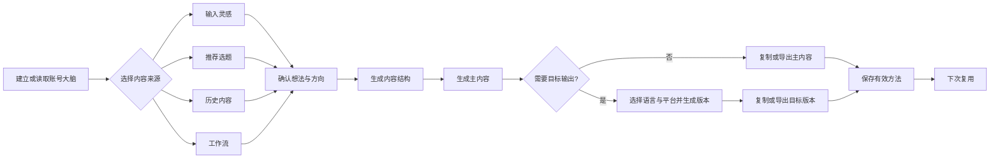
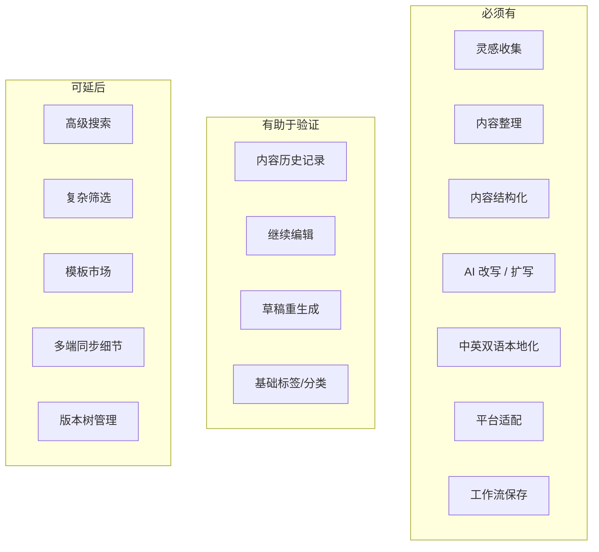

# ForgeNote · 全球华人博主内容操作系统 PRD

> 产品名：ForgeNote  
> 文档版本：v1.4  
> 状态：❄️ **已冻结（2026-07-12，D-13/D-14）——北极星愿景，非开发依据**  
> 说明：2026-07-11 曾短暂标记为 Active 事实源，次日被 Owner 拍板的 D-13/D-14 取代——M2 方向（结构生成系统）维持为事实源，本文冻结为长期愿景。当前执行见 `docs/GATE0-SLICE-PLAN.md`，冲突以 `docs/DECISIONS.md` 为准。

## 1. 产品概述

ForgeNote 是一款面向**全球华人独立博主**的 Web 内容操作系统。它帮助创作者从**灵感收集**开始，完成**整理、结构化、改写、中英双语本地化、跨平台适配**的完整内容工作流，并将这些工作流沉淀为可复用资产。

ForgeNote 的目标不是“单次生成一篇内容”，而是把内容生产变成一个可持续、可复用、可迭代的系统。

### 1.1 当前锁定原则

当前阶段优先锁定三件事：

1. 产品定义  
2. MVP 规划  
3. 验证路径

### 1.2 产品流程总览

---

## 2. 产品定义

### 2.1 目标用户

- 全球华人独立博主
- 个人创作者为主，不以团队协作为前提

### 2.2 优先内容领域

- 科技
- AI
- 商业
- 投资
- 个人成长

### 2.3 用户特征

- 以个人创作为主
- 经常在国内外多个平台发内容
- 有中英双语输出需求
- 内容不是一次性产出，而是持续复用、拆分、改写、迭代
- 希望把内容工作流沉淀为自己的方法论和资产

### 2.4 产品定义一句话

ForgeNote 先理解创作者的账号，再把每条灵感或推荐选题转化为可编辑结构、主内容和跨语言、跨平台版本，并将有效方法沉淀为可复用工作流。

### 2.5 双层产品模型

ForgeNote 由相互连接的两层组成：

1. **账号层（长期上下文）**：账号大脑保存受众、定位、主题边界、表达风格、有效模式、避免事项和平台偏好，回答“这个账号长期适合怎么表达”。
2. **内容任务层（单次创作）**：承接灵感、雷达选题、历史内容或工作流，完成方向确认、结构、主内容和目标输出，回答“这条内容现在怎么做”。

工作流连接两层：它保存某类内容的结构和处理方法，但不保存某篇内容的原始灵感与完整正文。

### 2.6 产品边界

本产品优先解决的是“内容创作工作流”问题，而不是：

- 社区分发
- 团队协作
- 自动发文
- 完整数据分析
- 媒体制作本身
- 通用笔记管理

---

## 3. 核心问题

### 3.1 当前痛点

1. 灵感分散在笔记、聊天记录、平台草稿和临时想法里，难以统一管理。  
2. 从想法到成稿需要反复整理，效率低。  
3. 中英双语内容通常要重复改写，本地化成本高。  
4. 同一内容要适配不同平台时，重复劳动多。  
5. 内容没有形成可复用的工作流，每次都要从头开始。

### 3.2 本质问题

用户缺的不是一个“会写字”的 AI，而是一个能够把内容生产过程系统化、模板化、资产化的内容操作系统。

---

## 4. 核心价值

### 4.1 价值主张

ForgeNote 帮助创作者把碎片灵感转化为结构化内容，并通过 AI 完成整理、改写、本地化与平台适配，最终沉淀为可复用工作流。

### 4.2 产品价值

- **更快**：缩短从灵感到发布的路径
- **更自动化**：减少手动整理和重复改写
- **更专业**：输出更符合平台语境和受众习惯
- **更可复用**：把每次创作沉淀成工作流和模板

### 4.3 差异化

ForgeNote 的差异化不在于“再做一个 AI 写作器”，而在于：

- 以**灵感收集**作为入口
- 以**工作流复用**作为核心
- 以**中英双语本地化**和**跨平台适配**作为能力
- 以**内容资产沉淀**作为长期价值

---

## 5. 核心任务（JTBD）

> 当我有一个粗糙想法时，帮我把它变成一条适合目标平台发布的内容，并在需要时同时输出中文和英文版本。

---

## 6. 核心使用路径

1. 首次建立账号大脑，或读取已有账号上下文；首次可跳过。  
2. 从灵感、推荐选题、历史内容或已有工作流开始。  
3. 确认主题、受众和内容角度。  
4. 生成并编辑内容结构。  
5. 基于已确认结构生成并编辑主内容。  
6. 如有需要，同时选择目标语言与平台并生成目标版本。  
7. 复制或导出可用内容。  
8. 将有效结构和设置保存为工作流，供下次复用。

### 6.1 用户侧术语规则

用户界面统一使用“生成目标版本”“创建平台版本”或具体动作，例如“生成 English · X 版本”。“派生”仅可作为工程内部概念，不得出现在面向用户的导航、按钮、提示或帮助文案中。

---

## 7. MVP 规划

### 7.1 MVP 目标

MVP 的目标不是覆盖完整产品能力，而是验证以下核心假设：

1. 用户是否愿意从灵感收集开始使用产品  
2. 用户是否会持续复用同一套工作流  
3. AI 辅助整理和本地化是否能明显减少创作成本  
4. 产品是否能进入用户的周常内容创作流程

### 7.2 MVP 最小可用闭环

第一版必须形成以下闭环：

建立或读取账号大脑 → 输入灵感 / 选择推荐选题 → 确认内容方向 → 生成可编辑结构 → 生成主内容 → 创建目标语言与平台输出 → 保存工作流 → 从历史或工作流复用

其中账号大脑首次可跳过，本地化与平台适配按目标输出合并选择且均非强制步骤。

### 7.3 MVP 范围内

- Web 应用
- 灵感收集入口
- 自动整理内容
- 内容结构化
- AI 辅助改写
- 中英双语本地化
- 国内外平台适配
- 工作流 / 模板保存
- 内容历史记录与复用

### 7.4 MVP 不做

- 平台 API 自动发布
- 团队协作
- 内容日历
- 复杂数据看板
- 社区功能
- 媒体生成与编辑本身
- 多账号管理
- 完整 CMS 替代

### 7.5 MVP 验收标准

以下能力完整可用时，MVP 才算成立：

1. 用户可以快速录入一个粗糙想法  
2. 系统能自动整理并生成可用结构  
3. 用户可以在结构基础上生成可编辑草稿  
4. 用户可以输出中文和英文版本  
5. 用户可以适配至少一个国内平台和一个海外平台  
6. 用户可以保存为可复用工作流  
7. 用户后续可以再次复用该工作流

### 7.6 MVP 交付原则

- 只做能验证核心假设的能力
- 只保留能形成闭环的路径
- 任何不影响验证的能力都延后
- 任何会显著增加复杂度的能力都先不做

### 7.7 MVP 功能清单

---

## 8. 核心功能模块

### 8.1 灵感收集

支持用户快速保存：

- 文本灵感
- 阅读摘录
- 临时想法
- 链接或引用

#### 要求

- 输入足够快
- 降低记录门槛
- 支持不完整想法
- 保留原始信息，便于后续重用

### 8.2 内容整理

系统应自动完成：

- 主题识别
- 相关碎片归类
- 角度建议
- 内容类型判断

### 8.3 内容结构化

系统应把粗糙想法转成可用结构，例如：

- 开头 / hook
- 背景 / context
- 关键观点
- 论据或例子
- 结尾 / CTA

### 8.4 AI 辅助写作

系统应支持：

- 基于结构生成草稿
- 扩写短内容
- 精简长内容
- 提升表达清晰度
- 调整语气和风格

### 8.5 中英双语本地化

系统应支持：

- 中文转英文
- 英文转中文
- 非直译式本地化改写
- 适配不同平台的语言习惯

### 8.6 平台适配

同一内容应可适配：

- 国内平台
- 海外平台
- 长文内容
- 短内容 / 线程内容

系统应自动调整：

- 长度
- 语气
- 格式
- CTA 风格
- 平台惯例

### 8.7 工作流复用

用户应能够保存：

- 结构模式
- 语气偏好
- 平台适配方式
- 可复用的内容流程

---

## 9. 页面结构建议

### 9.1 首页 / 工作台

工作台是主入口，用户进入后应立即看到当前可处理的灵感或内容任务。

建议包含：
- 当前任务入口
- 新建灵感入口
- 最近内容
- 快速生成动作

### 9.2 灵感收集页

用于快速记录碎片灵感。

建议包含：
- 快速输入框
- 链接粘贴
- 标签建议
- 最近收集内容

### 9.3 内容工作页

用于将灵感转化为结构化内容。

建议包含：
- 内容结构预览
- AI 改写区
- 中英双语切换
- 平台适配输出
- 局部编辑能力

### 9.4 模板 / 工作流页

用于保存和复用内容结构。

建议包含：
- 模板列表
- 模板详情
- 模板复用入口
- 模板适用场景说明

### 9.5 历史记录页

用于查看过去的灵感、内容和导出版本。

建议包含：
- 内容历史
- 版本记录
- 复用来源
- 搜索与筛选

---

## 10. 体验原则

- **先收集，再整理**：最快路径是先保存灵感
- **先工作流，后单篇内容**：用户应感知自己在建立系统
- **AI 是助手，不是替代品**：AI 帮助搭建流程，而不是替用户思考全部内容
- **双语默认**：中英双语不是附加能力，而是默认方向
- **复用优先**：每一次有效工作流都应可沉淀、可复用
- **平台感知**：输出应符合目标平台表达习惯

---

## 11. 核心指标

### 11.1 主指标

- 周活跃创作者数
- 人均每周灵感收集次数
- 从灵感到可导出内容的转化率
- 工作流复用率
- 已保存模板数量

### 11.2 辅助指标

- 中英双语输出使用率
- 多平台适配使用率
- 单篇内容节省时间
- 7 日留存
- 同一工作流的重复使用次数

---

## 12. 验证路径

### 12.1 验证目标顺序

验证路径按以下顺序推进：

1. 验证用户是否愿意从灵感收集开始进入产品  
2. 验证系统是否能把碎片灵感整理成可用结构  
3. 验证 AI 是否能显著降低改写和本地化成本  
4. 验证用户是否愿意保存并复用工作流  
5. 验证产品是否能进入用户的周常创作流程

### 12.2 验证方法

- 观察用户是否主动记录灵感
- 观察用户是否会重复使用同一流程
- 观察用户是否把平台当作主要创作入口
- 观察用户是否愿意在不同平台版本之间切换
- 观察用户是否将工作流沉淀为模板

### 12.3 验证通过信号

- 用户连续使用
- 用户开始迁移灵感
- 用户愿意复用模板
- 用户认为它比“笔记工具 + AI 工具 + 手工适配”更高效

---

## 13. 发布节奏建议

### 13.1 第一阶段

先做最小可用闭环，验证单人创作流程是否成立。

### 13.2 第二阶段

在复用成立后，再扩展模板库、平台适配和历史复用能力。

### 13.3 第三阶段

在使用稳定后，再考虑更复杂的自动化、协作或发布集成。

---

## 14. 第一版验证目标

第一版主要验证以下四件事：

1. 用户是否愿意从灵感收集开始使用 ForgeNote  
2. 用户是否会反复复用同一套工作流  
3. AI 辅助整理和本地化是否能明显减少创作成本  
4. 产品是否能进入用户的周常内容创作流程

---

## 15. 风险与约束

### 15.1 方向过宽

如果第一版同时支持过多内容形式和平台，产品会变重，验证也会变慢。

### 15.2 AI 能力同质化

单纯“改写”和“润色”很容易被替代，必须把重点放在工作流和内容资产沉淀上。

### 15.3 用户迁移成本

用户已经习惯在笔记工具、聊天工具和 AI 工具之间切换。ForgeNote 必须提供足够强的入口价值，才能成为主工作流入口。

---

## 16. 建议的第一切口

建议第一版的切入点定义为：

**从灵感收集开始，自动整理为可复用的内容工作流，并输出中英双语、平台适配版本。**

这个切口足够聚焦，也能承接长期方向。

---

## 17. 待确认问题

- 第一版优先支持的内容形态是什么：社媒帖子、线程，还是长文？
- 结构模板应当有多强的默认性？
- 第一版双语本地化需要达到什么程度？
- 第一版优先支持哪些国内和海外平台？
- 第一版应更偏向速度、结构质量，还是复用能力？

---

## 18. 附录

### 18.1 术语说明

- **灵感收集**：记录原始想法、摘录、引用、链接等碎片信息的入口。
- **内容结构化**：把粗糙想法整理为可生成、可编辑的内容骨架。
- **工作流**：从灵感到可发布内容的一整套可复用处理过程。
- **本地化**：不是直译，而是按目标语言与平台习惯重写表达。

### 18.2 版本记录

- v1.0：初始草案
- v1.1：补充产品定义、MVP、验证路径、流程与附录结构
- v1.2：补充 Mermaid 流程图并统一章节结构

### 18.3 UX 设计配套文档

- `USER-JOURNEY.md`：用户研究假设、关键任务与端到端用户旅程
- `INFORMATION-ARCHITECTURE.md`：核心对象、Sitemap、导航、页面清单与内容层级
- `UX-FLOW.md`：主流程、决策分支、异常恢复与风险节点

### 18.4 范围说明

本 PRD 仅定义第一版产品目标与边界，不包含详细交互稿、视觉规范和工程拆解。
