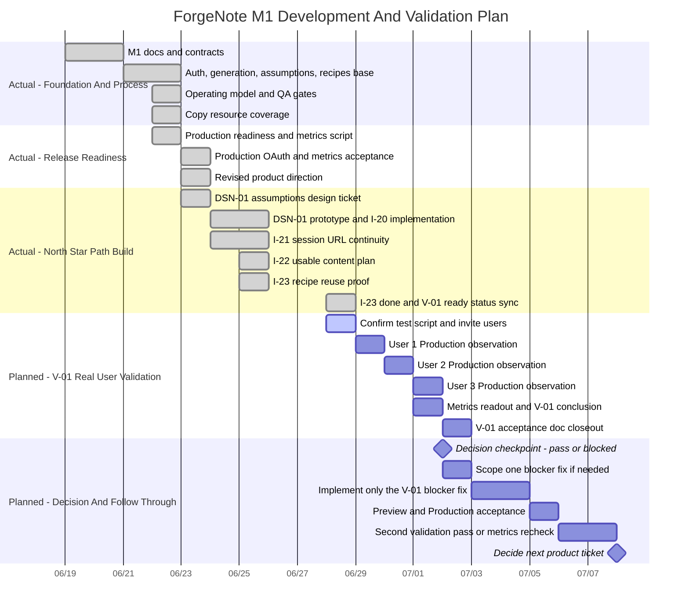

# ForgeNote Project Gantt

> 用途：Owner 自己管理执行节奏。
> 生成日期：2026-06-28。
> 依据：`docs/PROJECT-STATUS.md`、`docs/TICKETS.md`、`docs/acceptance/V-01.md`、git history。
> 排期原则：历史按已合并事实记录；未来按“激进但可执行”排，不把资产库、视觉渲染、自动学习、Stripe、runtime i18n 塞进当前路线。

## 关键判断

- I-20 / I-22 / I-23 已把三段主路径串起来：假设条 → 可用内容方案 → 配方复用。
- 当前唯一任务不是继续写功能，而是 V-01：用 1-3 个非构建者用户验证 Production 主路径。
- 如果 V-01 暴露阻塞，下一张实现票只修阻塞；如果 V-01 能跑通，下一步是第二轮更小样本复测和指标确认。

## Mermaid 甘特图

## 执行视图

| 时间 | 目标 | 产物 | 判定 |
|---|---|---|---|
| 2026-06-28 | 确认 V-01 脚本，约 1-3 个用户 | 用户名单 / 时间 / 测试入口 | 能安排到至少 1 个真实用户 |
| 2026-06-29 | 用户 1 跑 Production 主路径 | `docs/acceptance/V-01.md` 第一条记录 | 找到第一处真实卡点或跑通闭环 |
| 2026-06-30 | 用户 2 跑 Production 主路径 | 第二条记录 | 观察卡点是否重复 |
| 2026-07-01 | 用户 3 + 指标读出 | 第三条记录 / metrics snapshot | 判定 Pass / Conditional Pass / Blocked |
| 2026-07-02 | V-01 收口 | V-01 状态更新，下一张唯一任务明确 | 不再凭感觉加功能 |
| 2026-07-03 to 2026-07-05 | 只修 V-01 暴露的最大阻塞 | 一个小实现 PR 或无代码决策 | 不超过一个主问题 |
| 2026-07-06 to 2026-07-07 | 复测修复或第二轮验证 | 新证据 / 指标对比 | 决定继续验证还是进入下一张实现票 |

## 管理规则

1. V-01 没收口前，不新增功能票。
2. 用户说“看不懂/不知道下一步”比用户提出“想要更多功能”优先级高。
3. 如果 1 个真实用户都约不到，问题不是排期，是验证渠道阻塞；状态应写 Blocked。
4. 如果 Production 登录、生成、保存、重跑任一环节坏掉，下一票只修这一个阻塞。
5. 如果 2 个以上用户能独立完成主路径，再考虑内容质量、复用价值和下一轮产品票。

## 不排期清单

这些不是当前甘特图的任务：

- 资产库
- 视觉渲染 / 出图编辑器
- 自动学习闭环
- Stripe / 付费
- runtime i18n
- 内容日历
- 多账号工作区
- 大规模竞品研究

原因很简单：当前还没证明一个真实用户能顺利跑完主闭环。现在继续堆功能是逃避验证。
