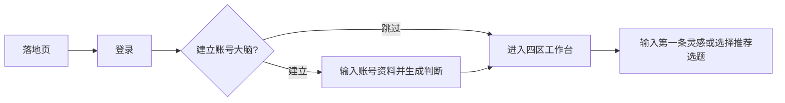
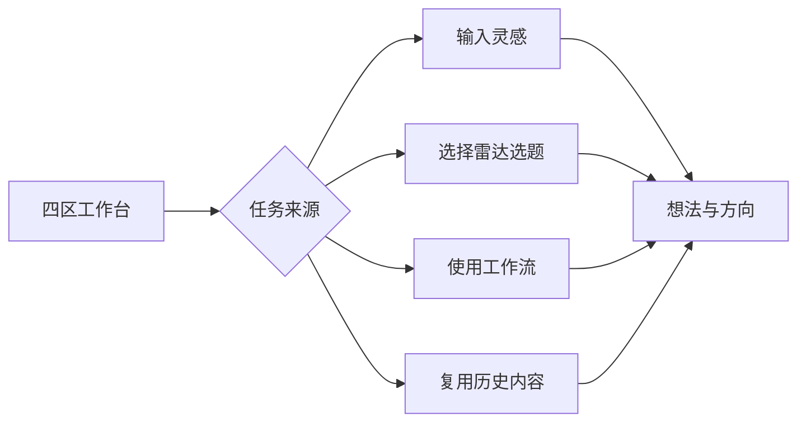
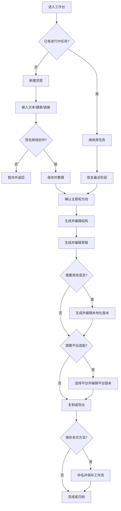
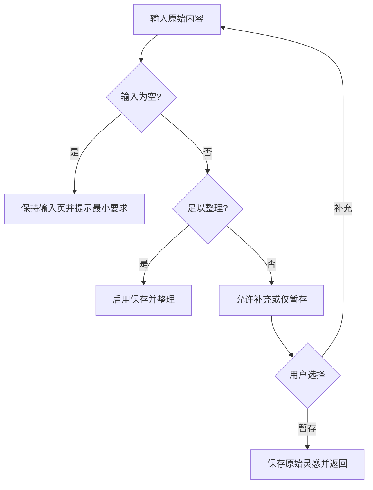
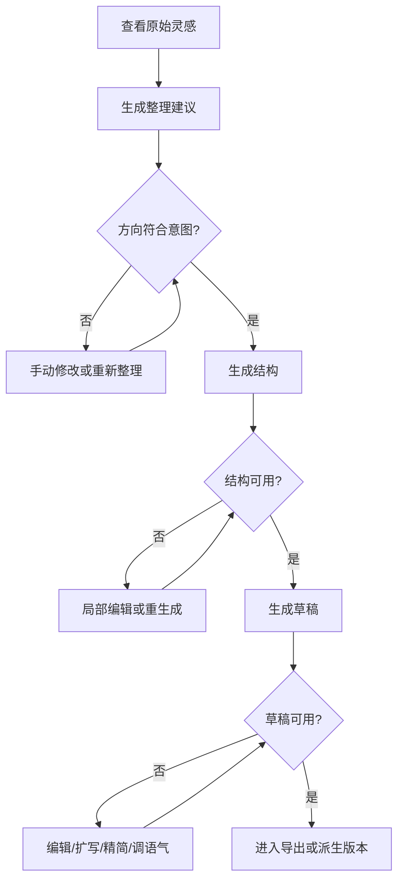
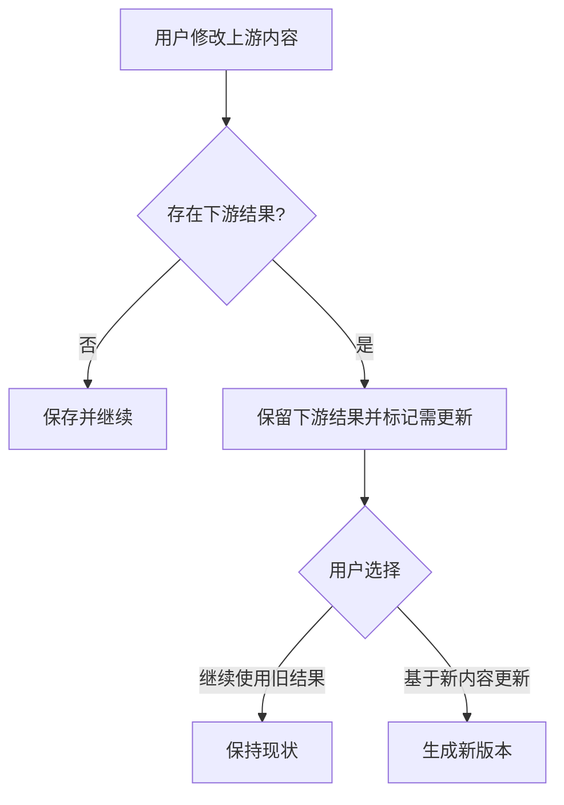
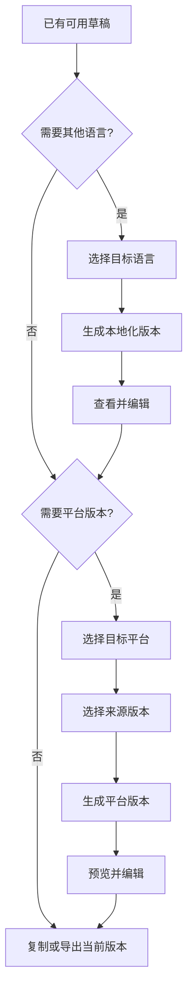
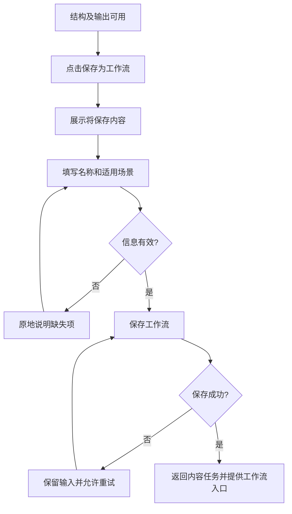
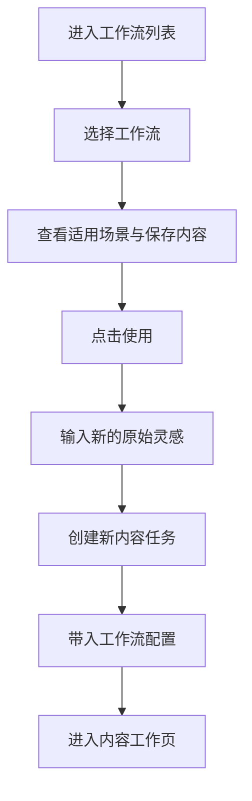

# ForgeNote · UX Flow

> 文档版本：v1.1  
> 状态：❄️ 已冻结（2026-07-12，D-13/D-14）——北极星愿景的 UX 基线，非开发依据；当前执行见 `docs/GATE0-SLICE-PLAN.md`  
> 日期：2026-07-11

## 1. 文档目的

本文档定义 ForgeNote MVP 的关键任务流程、页面流转、用户决策、系统反馈、异常恢复与风险节点。

它不重复用户研究和信息架构：

- 用户、场景、任务与旅程依据见 `USER-JOURNEY.md`
- 核心对象、导航、页面清单与内容层级见 `INFORMATION-ARCHITECTURE.md`
- 产品目标和 MVP 边界见 `PRD-CCOS.md` 与 `MVP-FEATURE-LIST.md`

---

## 2. Flow 设计原则

1. **先保存，再完善**：不完整输入也可以暂存。
2. **先确认方向，再生成长内容**：降低错误方向带来的返工。
3. **保持用户控制**：AI 输出可修改、可拒绝、可重试。
4. **可选步骤不阻塞完成**：本地化、平台适配和保存工作流不是所有任务的强制步骤。
5. **错误原地恢复**：失败后保留输入、上次结果和当前上下文。
6. **不静默覆盖**：重生成与上游修改不得删除用户编辑。
7. **区分继续与复用**：继续历史任务恢复原内容；复用创建新任务。

---

## 3. 关键任务

| Flow ID | 任务 | 优先级 | 起点 | 成功终点 |
|---|---|---|---|---|
| UF-01 | 新建灵感并开始创作 | P0 | 工作台 / 全局新建 | 内容任务进入可编辑状态 |
| UF-02 | 从灵感生成可用内容 | P0 | 内容工作页 | 至少一个版本可复制或导出 |
| UF-03 | 本地化并适配平台 | P0 | 可用草稿 | 目标语言或平台版本可导出 |
| UF-04 | 保存并复用工作流 | P0 | 已有结构与输出 | 用工作流创建新内容任务 |
| UF-05 | 恢复历史任务 | P1 | 工作台 / 历史记录 | 回到原任务最近可用状态 |

---

## 4. 融合后的核心成功路径

### 4.1 首次使用

账号大脑是长期上下文而非每次创作步骤；跳过后仍可完成内容任务，但界面应说明结果缺少账号依据。

### 4.2 日常任务入口

### 4.3 端到端 Flow

### 4.4 完成定义

核心内容任务不以“完成全部步骤”为标准。满足以下任一条件即可视为产生可用结果：

- 通用草稿达到可复制或导出状态
- 一个语言版本达到可复制或导出状态
- 一个目标平台版本达到可复制或导出状态

---

## 5. UF-01 新建灵感并开始创作

### 5.1 主流程

| 步骤 | 页面 | 用户动作 | 系统响应 | 下一步 |
|---|---|---|---|---|
| 1 | P-01 工作台 | 点击新建灵感 | 打开 P-02 | 输入 |
| 2 | P-02 灵感收集 | 输入文本、摘录或链接 | 保留原始输入；可解析链接 | 判断输入 |
| 3 | P-02 | 点击保存并整理 | 保存灵感并创建内容任务 | 打开 P-03 |
| 4 | P-03 内容工作页 | 查看整理结果 | 展示主题、关键词和方向 | 确认或修改 |

### 5.2 输入决策

### 5.3 异常与恢复

| 异常 | 系统反馈 | 内容保护 | 恢复路径 |
|---|---|---|---|
| 链接无法解析 | 说明无法读取，不把链接判为空 | 保留链接和已输入文字 | 粘贴摘要或直接暂存 |
| 保存失败 | 原地提示失败原因 | 保留全部输入 | 重试保存 |
| 用户中途离开 | 提示尚未保存 | 保留当前输入直到用户确认 | 继续编辑或放弃 |

### 5.4 风险节点

- 初次输入要求过多导致放弃
- “保存并整理”和“暂存”差异不清
- 保存后自动进入整理不符合用户当下意图

---

## 6. UF-02 从灵感生成可用内容

### 6.1 主流程

### 6.2 方向确认

| 用户决策 | 系统行为 | 设计要求 |
|---|---|---|
| 接受整理结果 | 解锁结构生成 | 不要求额外确认弹层 |
| 修改主题或方向 | 保存用户修改 | 标记后续生成以新方向为依据 |
| 重新整理 | 生成新建议 | 保留原始输入和上一版建议 |
| 暂停 | 自动保存当前进度 | 工作台显示可继续阶段 |

### 6.3 结构生成与编辑

- 结构至少包含开头、主体与结尾。
- 用户可编辑单个结构块，不必重生成全文。
- 重生成前若用户已编辑，需提示将创建新版本或保留上一版。
- 结构失败时留在结构阶段，不回退到灵感收集。

### 6.4 草稿生成与编辑

- 草稿以已确认结构为来源。
- 支持全文生成和局部扩写、精简、语气调整。
- 局部操作失败不影响全文。
- 用户可直接手动写作，不强制使用 AI。

### 6.5 上游修改规则

### 6.6 异常与恢复

| 异常 | 系统反馈 | 内容保护 | 恢复路径 |
|---|---|---|---|
| 整理不准确 | 指出结果可修改 | 保留原文和上一版 | 手动纠偏或重试 |
| 结构质量不足 | 提供局部修改与重生成 | 保留用户编辑版本 | 调整后继续 |
| 草稿生成失败 | 说明失败发生在草稿阶段 | 保留结构和上一稿 | 重试或手动写作 |
| AI 暂不可用 | 不阻塞已有内容编辑 | 自动保存手动修改 | 稍后重试 |

---

## 7. UF-03 本地化与平台适配

### 7.1 主流程

### 7.2 版本关系

- 本地化版本必须标明来源草稿。
- 平台版本必须标明来源语言版本或通用稿。
- 每个版本独立编辑；编辑平台版本不反向覆盖来源版本。
- 切换语言或平台只切换视图，不触发自动重生成。

### 7.3 异常与恢复

| 异常 | 系统反馈 | 内容保护 | 恢复路径 |
|---|---|---|---|
| 本地化太直译 | 提供表达风格调整 | 保留原版本和用户修改 | 重生成或手动改写 |
| 平台适配结果不理想 | 说明目标平台与来源 | 保留通用版本 | 局部修改或重新适配 |
| 单个平台生成失败 | 仅该平台显示错误 | 其他版本不受影响 | 原地重试 |
| 来源版本已更新 | 标记平台版本基于旧来源 | 不自动覆盖 | 用户决定是否更新 |
| 复制或导出失败 | 明确未完成导出 | 内容仍在任务内 | 再次复制或导出 |

### 7.4 风险节点

- 用户不清楚先选语言还是平台
- 多版本标签相似导致误编辑
- 用户将“适配”误解为自动发布
- 平台规则过时损害信任

---

## 8. UF-04 保存并复用工作流

### 8.1 保存 Flow

### 8.2 保存范围

保存：

- 结构模式
- 关键处理步骤
- 语气偏好
- 语言和平台适配配置
- 适用场景说明

不默认保存：

- 本篇原始灵感
- 本篇完整正文
- 本篇专有事实和例子

### 8.3 复用 Flow

### 8.4 异常与恢复

| 异常 | 系统反馈 | 内容保护 | 恢复路径 |
|---|---|---|---|
| 保存信息不足 | 指明缺失项 | 不关闭弹层 | 补充后保存 |
| 保存失败 | 说明内容任务已安全保存 | 保留工作流字段 | 重试或稍后保存 |
| 旧工作流配置不完整 | 标出需要确认的配置 | 不修改原工作流 | 补充后创建任务 |
| 复用创建失败 | 留在工作流上下文 | 不创建空白任务 | 原地重试 |

### 8.5 风险节点

- 用户不理解保存的是“方法”而非文章
- 保存时机过早，价值尚未建立
- 工作流详情信息过多，复用决策变慢

---

## 9. UF-05 恢复历史任务

### 9.1 主流程

| 步骤 | 页面 | 用户动作 | 系统响应 |
|---|---|---|---|
| 1 | P-01 / P-07 | 选择历史内容 | 读取任务最近状态 |
| 2 | P-03 | 再次打开 | 恢复最近阶段、内容和版本 |
| 3 | P-03 | 继续编辑 | 保存到原任务的新版本 |

### 9.2 继续与复用的区别

| 操作 | 结果 | 原任务 |
|---|---|---|
| 再次打开 / 继续编辑 | 恢复原内容任务 | 被继续修改并形成历史版本 |
| 基于此内容复用 | 创建新的内容任务 | 保持不变 |
| 使用关联工作流 | 用方法创建新任务 | 保持不变 |

### 9.3 异常与恢复

- 最近版本不可用时，展示最近可用版本。
- 无任何可恢复版本时，不创建伪造空任务；返回历史并允许新建。
- 恢复过程中网络失败时，保留用户所在列表与筛选条件。

---

## 10. 跨 Flow 系统反馈

| 节点 | 必要反馈 |
|---|---|
| 保存原始灵感 | 已保存到哪里、是否已开始整理 |
| AI 生成 | 当前生成对象、可否取消、旧内容是否安全 |
| 自动保存 | 保存中、已保存或保存失败 |
| 重生成 | 是否保留用户编辑和上一版 |
| 上游修改 | 哪些下游版本可能需要更新 |
| 导出 | 导出的版本、目标平台和是否成功 |
| 保存工作流 | 保存了什么、在哪里找到、如何再次使用 |
| 创建复用任务 | 新任务与原内容或工作流的关系 |

---

## 11. 风险节点总表

| 节点 | 风险 | 严重度 | UX 策略 | 验证指标 |
|---|---|---|---|---|
| 灵感输入 | 门槛过高导致退出 | 高 | 最小必填、允许暂存 | 输入到保存转化率 |
| 整理确认 | AI 方向偏离 | 高 | 原文可见、可修改 | 整理接受/修改率 |
| 结构生成 | 结果模板化 | 高 | 局部编辑、保留版本 | 结构后继续率 |
| 草稿生成 | AI 味重、返工高 | 高 | 局部动作、直接编辑 | 草稿编辑量与导出率 |
| 上游修改 | 下游内容被覆盖 | 高 | 保留并标记需更新 | 内容丢失反馈数 |
| 多版本切换 | 来源不清、误编辑 | 高 | 明确版本树与来源 | 版本切换错误率 |
| 导出 | 被误解为自动发布 | 中 | 明确复制/导出边界 | 发布相关误解反馈 |
| 工作流保存 | 概念抽象 | 高 | 展示保存内容和收益 | 保存率与二次复用率 |
| 历史恢复 | 继续与复制混淆 | 中 | 区分操作结果 | 误改原任务反馈 |

---

## 12. Flow 验收条件

- 用户可以仅保存灵感而不被迫完成后续步骤。
- 用户可以从粗糙输入完成至少一个可导出版本。
- 本地化和平台适配可按需跳过。
- 每个 AI 生成节点都有编辑、重试或退出路径。
- 任何失败都不清空原始输入或已编辑内容。
- 上游修改不会静默覆盖下游结果。
- 从历史继续与创建副本复用有明确不同结果。
- 从工作流复用会创建新任务，不修改原工作流。
- 所有关键步骤均可映射到 `INFORMATION-ARCHITECTURE.md` 中的页面。

---

## 13. 待验证问题

- 用户是否愿意在整理后显式确认方向？
- 本地化与平台适配是否应作为两个连续步骤，还是以“目标输出”合并选择？
- 用户何时最愿意保存工作流？
- 上游修改后的“需更新”提示是否足够易懂？
- 用户更偏好从历史内容复用，还是从抽象工作流复用？
- 哪些异常值得阻断流程，哪些只需局部提示？

---

## 14. 下一阶段验证

- 研究问题、测试任务和通过门槛见 `UX-STRUCTURE-VALIDATION.md`。
- 关键页面、阶段和异常的低保真表现见 `LOW-FIDELITY-WIREFRAMES.md`。
- 可点击原型跳转和测试轮次见 `LOW-FIDELITY-PROTOTYPE-PLAN.md`。
- 研究发现必须回填本文件，不能只修改原型。

---

## 15. 版本记录

- v1.0：由原 `USER-FLOW.md` 重构，补充关键任务 Flow、决策节点、页面映射、异常恢复、风险节点和验收条件。
- v1.1：补充 UX 结构验证和低保真原型阶段衔接。
